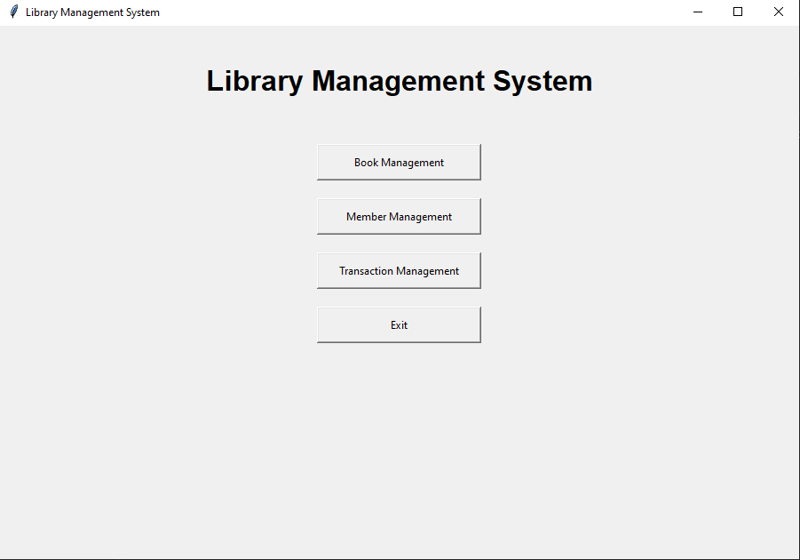
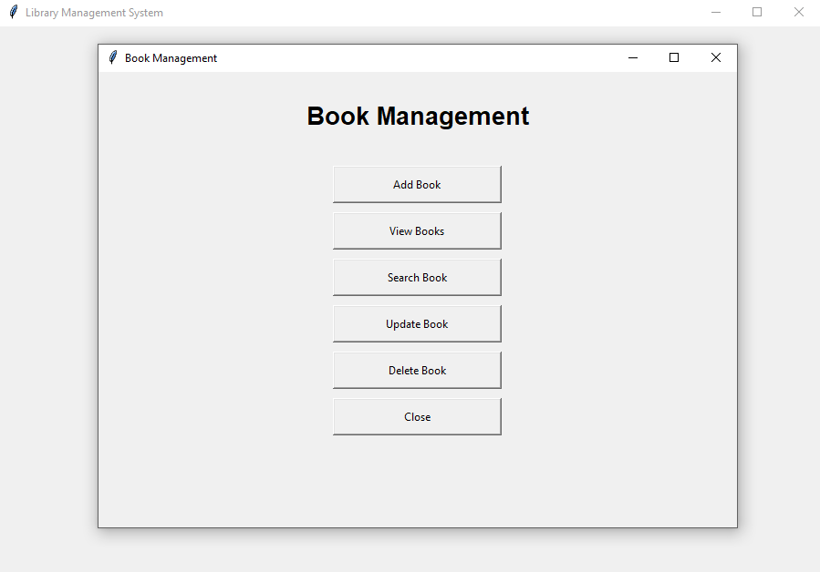
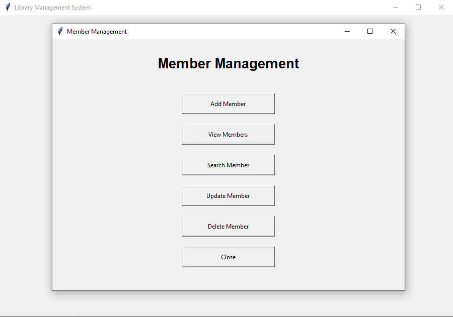
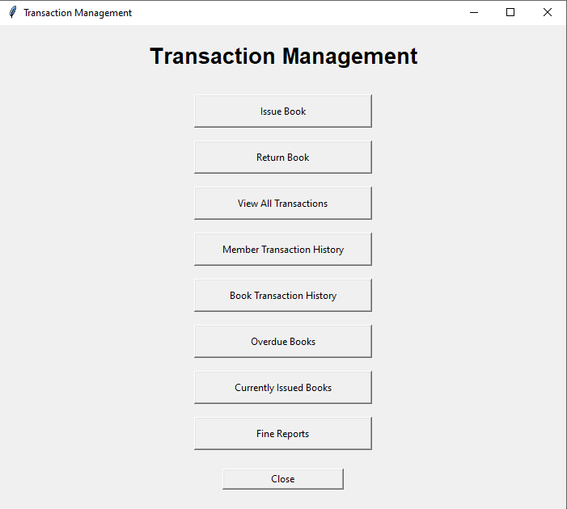

# Library Management System V2

A Python-based Library Management System built with SQLite and Tkinter. This project helps manage books, members, and library transactions through a desktop GUI.

## Features

### Book Management
- Add, view, search, update, and delete books
- Track total and available book quantities
- Soft delete to preserve records

### Member Management
- Add, view, search, update, and delete members
- Store member contact information
- Soft delete to preserve records

### Transaction Management
- Issue books to members
- Return issued books
- View all transactions
- View member and book transaction history
- View overdue books
- View currently issued books
- Generate fine reports

## Technologies Used

- Python
- SQLite
- Tkinter
- pytest
- Git and GitHub

## Project Structure

```text
Library Management System V2/
├── assets/
├── database/
│   ├── database.py
│   └── library.db
├── gui/
│   └── main_window.py
├── modules/
├── services/
├── tests/
├── utils/
├── main.py
├── .gitignore
└── README.md
```

## How to Run

1. Install Python.
2. Clone or download this repository.
3. Open the project folder in VS Code.
4. Open the terminal in the project root.
5. Run:

```bash
python main.py
```

## Run Tests

From the project root, run:

```bash
python -m pytest
```

## Screenshots

### Dashboard



### Book Management



### Member Management



### Transaction Management



## Project Status

The application includes a Tkinter desktop interface, SQLite database integration, book and member management, transaction workflows, and reports.

Backend test checkpoint: 94 tests passed.

## Author

Gaurav Thakar

GitHub: https://github.com/Gauravthakar

LinkedIn: https://www.linkedin.com/in/gauravthakar9/